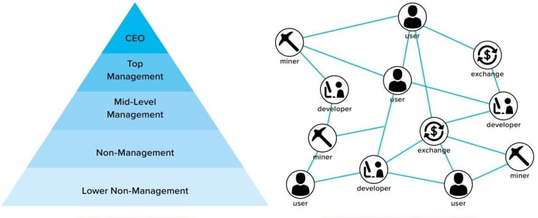

# DAO

### ¿Qué es una DAO?

Para entender a qué se refiere este nuevo concepto, primero, hay que entender las palabras que lo conforman.

1. **Organización:** grupo de individuos que se reúnen y trabajan en conjunto para lograr un objetivo y fin determinado.
2. **Autónoma:** entidad que goza de la capacidad para actuar de forma independiente a agentes externos.
3. **Descentralizada:** no cuenta con una autoridad central; las funciones se encuentran dispersas y cada uno de los miembros tiene el poder de emitir su voto.

*(Imagen: Diferencia entre la estructura de una organización tradicional y una descentralizada)*

Dentro de toda organización es importante conocer quién toma las decisiones y cómo lo hace. Las Organizaciones Autónomas Descentralizadas están basadas en [DLT](/fundamentos/blockchain/dlt.md) y las reglas del juego definidas dentro de smart contracts o *compoenentes* como se conocen en RadixDLT.

### Características de las DAO:

- Un objetivo común que cumplir, como resolver un problema, generar valor o simplemente comprar algo
- Gobernanza entendida como la inclusión de todos los miembros en la toma de decisiones; se busca una estructura de gobierno horizontal.
- Bienes compartidos, el capital que se reúne le pertenece a toda la comunidad y es la misma comunidad la que a través de tokens de gobernanza emite su voto y decide que hacer con ese capital.
- Barreras de entrada mínimas, hasta ahora suele ser poseer tokens de gobernanza.
- Propiedad de la comunidad: en este tipo de organizaciones cualquiera que aporta valor a la organización puede ser dueño de una parte importante de la misma; no únicamente los fundadores e inversores tempranos.

