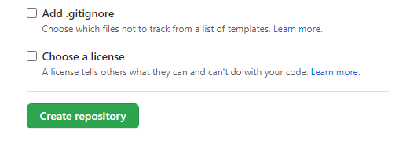
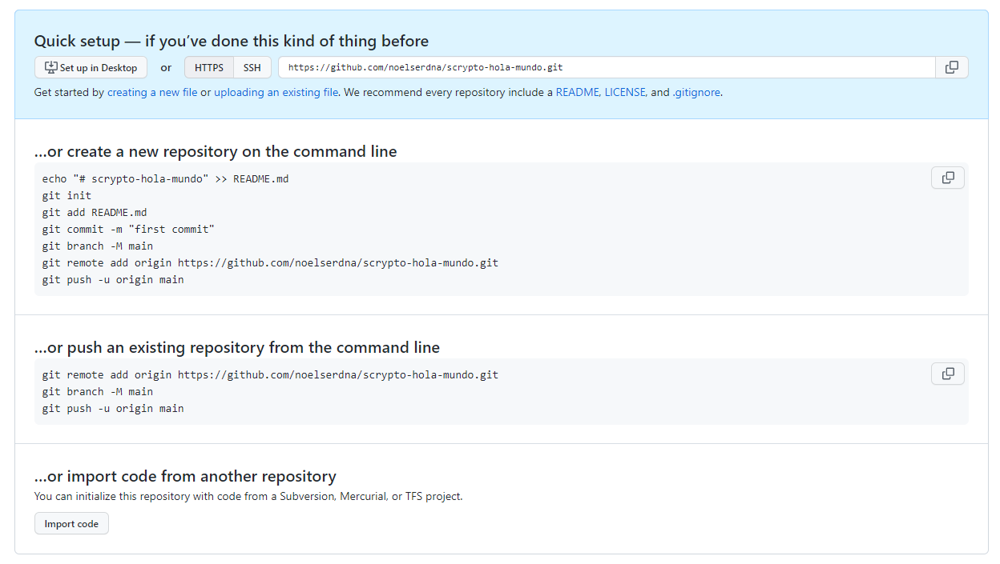
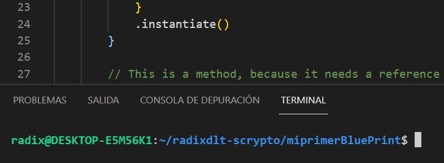

# Básicos remoto - GitHub


::: warning Requisitos
- [Ya deberías tener una cuenta en GitHub](/fundamentos/git/unidad1.html#crea-una-cuenta-en-github), tan solo es necesario un correo electrónico, ir al sitio web de [GitHub](https://github.com/) y rellenar el formulario de registro.
:::

### Repositorios

Los repositorios en GitHub son el lugar donde se guardan tus proyectos de forma individual. Para crear un nuevo repositorio dentro de Github:

1. En la esquina superior derecha de cualquier página, utiliza el menú desplegable  y selecciona Repositorio Nuevo.


2. Teclea el nombre de tu repositorio, y una descripción opcional.


3. Elige la visibilidad del repositorio: Público o Privado (normalmente seleccionaremos público)


4. Haz clic en Crear repositorio.



5. GitHub nos muestra las instrucciones a seguir para subir nuestro proyecto al *repositorio* que acabamos de crear.
 


### Enviar nuestro proyecto a repositorio de Github

Como vimos antes Github al crear un repositorio nuevo nos finaliza dando las instrucciones a seguir, siguiendo con el ejemplo anterior fueron las siguientes:
 


1. Entrar en el directorio de nuestro *Package* de Scrypto (con el terminal)

*Nota: Para poder seguir con los siguientes pasos ya hemos de haber iniciado git y commiteado los cambios de manera local, como se muestra en la [unidad anterior](/fundamentos/git/unidad2.md), este directorio del package.*



2. Y utiliza el comando *git remote add* seguido de: nombre remoto *holamundo* (shortname) y la Url remota en este caso de nuestro repositorio git.

```
git remote add holamundo https://github.com/noelserdna/scrypto-hola-mundo.git
```

::: tip
- El comando *git remote* nos muestra una lista de repositorios remotos agregados.
```
git remote
```
:::

3. Creamos una *rama* principal donde se guardará nuestro proyecto, en la siguiente unidad veremos lo que son las ramas y como utilizarlas. 

```
git branch -M main
```

4. Enviamos nuestro proyecto a GitHub con el comando *git push* seguido de la bandera *-u* que establece el repositorio como principal, el repositorio remoto que hemos agregado para este proyecto: *holamundo* y la rama que hemos establecido con el nombre *main* en el paso anterior.

```
git push -u holamundo main
```


::: tip
- A partir de ahora normalmente solo utilizaremos el comando *git push* para subir los archivos a nuestro repositorio en Github.
```
git push
```
:::


