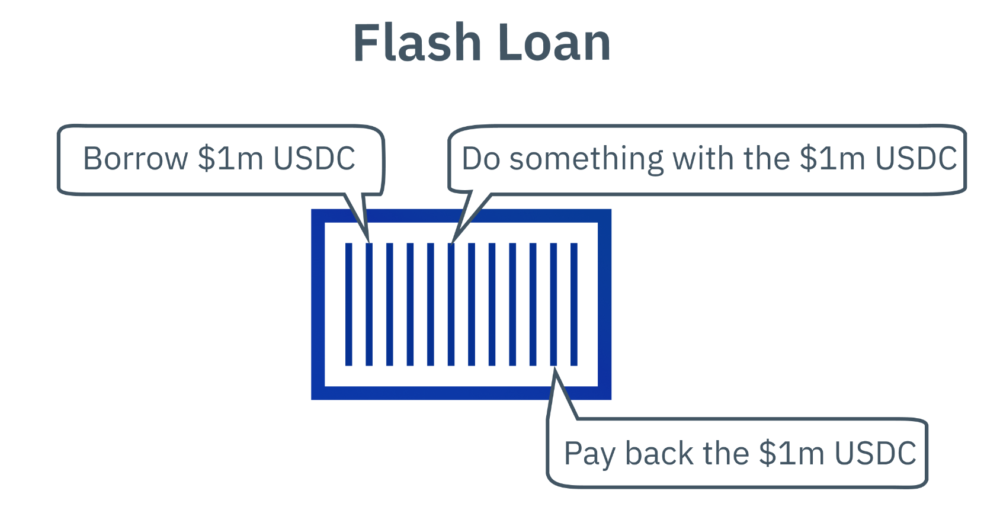
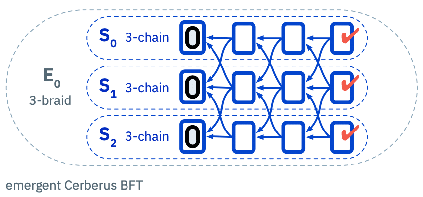

# Composición Atómica
Son dos características que por separado son muy útiles en el mundo DeFi pero juntas llevan a las dApps DeFi al siguiente nivel permitiendo crear productos, servicios y características muy novedosos. ¿Pero que significas estos dos términos?

### La Atomicidad
Es la capacidad de que una transacción pueda contener muchas acciones, como por ejemplo trasferencia de tokens o llamadas a dApps. Para que la transacción sea aceptada y procesada todas las acciones deben ser correctas y posibles.

Si alguna parte de la transacción es incorrecta o está en conflicto, toda la transacción debería fallar. Gracias a esta capacidad se pueden realizar transacciones complejas y seguras. 

*Según el diagrama anterior, todas las transacciones dentro del bloque se liquidan juntas, lo que garantiza que todos los fondos tomados en préstamo como parte de un préstamo flash se devuelvan.*

### La Composición
Es la capacidad de que las dApps puedan interoperar juntas sobre una base de *transacción por transacción*. Diferentes productos o servicios financieros se pueden combinar libremente unos con otros y así crear una oferta más poderosa, compleja y personalizada para cada necesidad específicas del usuario. *Transacción por transacción* hace referencia esta unión de dApps se lleva a cabo para cada transacción individual sobre la marcha. Esto permite un nivel de flexibilidad e innovación impensables en los sistemas tradicionales. 

La capacidad de composición hace posible construir un servicio DeFi que, por ejemplo, proporciona instantáneamente el mejor tipo de cambio para una operación en múltiples creadores de mercado automatizados, o permite el apalancamiento de un grupo de liquidez de crowdsourcing para aprovechar instantáneamente una oportunidad de arbitraje.

Fundamentalmente, para que estas aplicaciones DeFi funcionen, la *capacidad de composición* debe ser *"atómica"*, lo que significa que la transacción completa debe ser válida y se aceptan todas las acciones a la vez, o la transacción completa fallara. Esto (combinado con la descentralización) es lo que hace que DeFi sea mucho más poderoso, flexible y abierto a la innovación que los sistemas financieros tradicionales.

Y todo esto lo logra Radix gracias a su protocolo de consenso *Cerberus* el cual, [en su versión de Xi'an](/scrypto/roadmap.md), elimina las barreras entre sus fragmentos **"trenzando"** directamente los procesos de consenso en uno solo, de forma atómica y sobre la marcha para cada transacción individual. Lo que significa que la capacidad de composición es tan libre y sin fricciones como en una sola cadena de bloques, pero sin los límites de escalabilidad.

**Y eso es la magia de Radix...** esto es lo que hace tan especial esta red, además de Scrypto. Consiguen escalar sin romper la *composición atómica*. Esto es lo que le da ese plus tecnológico que, en el momento de escribir estas palabras, ninguna otra red consigue. 

::: warning Resumen:
La composición atómica permite crear dApps flexibles y poderosas. 
:::

### Contenido Extra
- [¿Qué es la composibilidad de DeFi y por qué es importante?](https://www.radixdlt.com/post/what-is-defi-composability-and-why-does-it-matter)
- [¿Qué es un préstamo flash?](https://www.radixdlt.com/post/what-is-a-flash-loan])

### Bibliografía
- [Cómo está diseñado Radix Engine para escalar dApps](https://www.radixdlt.com/post/how-radix-engine-is-designed-to-scale-dapps)
- [¿Qué es la composibilidad atómica?](https://learn.radixdlt.com/article/what-is-atomic-composability)
- [Gran avance en la teoría del consenso: escalar DeFi sin romper la composibilidad](https://www.radixdlt.com/post/breakthrough-in-consensus-theory-scaling-defi-without-breaking-composability)

