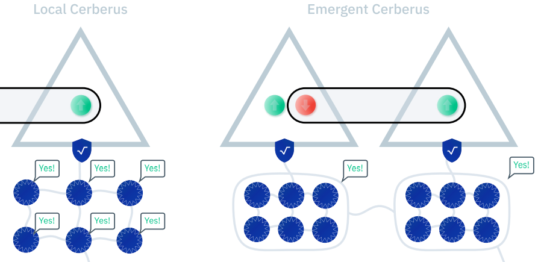

# Fragmentado

En el mundo de la computación el *fragmentado*, o sharding en inglés, consiste en dividir el almacenamiento de datos en trozos mas pequeños y manejables. Se suele implementar cuando el sistema se convierte tan grande que llega a **degradarse el rendimiento**. Normalmente se logra compartiendo la carga de almacenamiento ente diversas computadoras permitiendo al sistema ser **más escalable**.  

Normalmente en las [DLT](/fundamentos/#¿que-es-un-dlt.md), y en especial en las *Blockchain*, todos los nodos almacenan y procesan **todos los datos** del libro mayor, o Ledger en inglés. Esto es precisamente porque son sistemas que no estan fragmentados. Si tuvieramos que hacer un simil, es como si todos los coches tuvieran que circular por un solo carril, entre más coches mas lento es el tráfico. Lo mismo sucede con las transacciones en las DLT: como solo tienen un carril, ya que no estan fragmentadas, tienen velocidades bajas: entre 7 (Bitcoin) a 65000 (Solana) transacciones por segundo. 

La conclusión es clara: "la fragmentación es necesaria", para poder escalar las DLT y así poder satisfacer las necesidades actuales y futuras de las DeFi a nivel mundial. 

Esto nos lleva a otro problema: cuando las DLT, a lo largo de su corta historia, han intentado fragmentar su libro mayor para ser mas escalables han perdido algo importantísimo en el mundo DeFi, la [Composición Atómica](/radix/unidad4.md).

Radix siendo muy consciente de estos dos problemas lleva años desarrollando una solución brillante, tecnológicamente hablando. En su próximo [lanzamiento de la red Xi'an](/scrypto/roadmap.md) Radix *pre-fragmentará* su libro mayor en 2^256 trozos o fragmentos y además todas sus transacciones contarán con la posibilidad de *composición atómica* 🤯.

¿Cómo consigue Radix lograr este hito tecnológico?

Para entenderlo primero hemos de ser conscientes de que el [protocolo de consenso Cerberus](/radix/unidad3.md) es quien se encargará de que todo esto sea posible. Con Cerberus los fragmentos (2^256) serán esencialmente contenedores de *"sub-estados"*. A su vez los *"sub-estados"* son unidades de datos que registran todos los cambios en el libro mayor. Cada fragmento tendrá su correspondiente *sub-estado* y una dirección que lo identificará del resto de fragmentos. 

A diferencia de otras DLT los nodos solo guardarán una porción del espacio fragmentado. En cuanto más poderoso sea el hardware de un nodo más fragmentos podrá servir, aunque es de esperar que con el tiempo el volumen de transacciones aumente tanto que los nodos vean reducido el espacio fragmentado que servirán. Multiples nodos servirán *el mismo espacio fragmentado*, a este conjunto de nodos se les conocerá como "Conjunto de Validadores", es de esperar que un mismo nodo pertenezca a diversos *conjuntos de validadores*. 

Como ya hemos mencionado, un *sub-estado* es una unidad de datos. Por tanto, todo el conjunto de *sub-estados*, millones de ellos repartidos en millones de fragmentos, compondrán el *estado* del libro mayor de Radix. Los *sub-estados* son inmutables, para cambiarlos hay que crear uno nuevo. Los *sub-estados* en Radix no tienen que solo representar números, pueden ser cualquier cosa "digital".

::: tip
Las transacciones en Radix se parecen mucho al modelo UTXO de Bitcoin o Cardano. Pero en vez de simplemente transferir un tipo de token (BTC), gracias a los *sub-estados* de Radix las transacciones pueden contener cualquier cosa, incluso contratos inteligentes. 
:::

Las transacciones, contendrán como mínimo dos *sub-estados*, uno para registrar el cierre de un *sub-estados* anterior y otro que genera una nueva entrada en el libro mayor con su correspondiente *sub-estados* y por tanto su correspondiente nuevo fragmento donde se alojara a la espera de que en un futuro otra transacción lo de por cerrado. ¡Te diste cuenta! a una escala diferente, los fragmentos/*sub-estados* se comportan como una cadena, pero en este caso en vez de ser una cadena global es algo más individualizado. 

Como hemos indicado antes, las transacciones deben como mínimo contener dos *sub-estados*, pero estás pueden ser mucho más complejas y contener muchos más *sub-estados*, a modo de ejemplo una transacción puede cerrar un *sub-estados* y abrir dos nuevos. ¡Las posibilidades son infinitas!

¿Como encontrar un dato? Esta es una buena pregunta, ya que el **fragmentado** lo puede hacer todo más difícil. Por ejemplo: ¿como sabemos que nodos contienen ese dato? ya que como vimos antes solo algunos nodos proveerán la información contenida en cierto "espacio fragmentado".

Si recuerdas, antes vimos que los fragmentos se crearan todos en el libro mayor desde un mismo principio y que cada fragmento tendrá una dirección única. Esto quiere decir a modo de símil, que todas las casa (fragmentos) estarán construidas antes de que lleguen sus habitantes (datos).

Cuando creamos una **transacción** esta contendrá un identificador único, y a cada sub-estado que contenga se le asignara un indice. La combinación de estos dos datos el ID de la transacción y el índice del sub-estado generaran un *hash* de 256 bits único que se le asignara como identificador a ese sub-estado. Este identificador que acabamos de crear para el sub-estado es a su vez el número (identificador) de fragmento donde vivirá. Esto significa que cuando veamos un sub-estado de forma directa sabremos por su identificador cual es su dirección de fragmento. ¡Brutal!

::: tip
Los algoritmos que crean este tipo de *hash*, que actuará como identificador del sub-estado, son **deterministas**. Esto quiere decir que mismos datos de entrada siempre obtendrán los mismos datos resultantes o *identificadores* (hash) de salida.
:::

Este enfoque único es una parte clave de lo que permite a Cerberus procesar casi número ilimitado de transacciones paralelas, ya que Cerberus nunca se quedará sin fragmentos.

::: danger Nunca habrá colisiones....
- 
- 
:::

::: warning Resumen:
- Radix *pre-fragmentará* su libro mayor en 2^256 trozos o fragmentos
- A su vez los *"sub-estados"* son unidades de datos que registran todos los cambios en el libro mayor.
- Cada fragmento tendrá su correspondiente *sub-estado* y una dirección que lo identificará del resto de fragmentos.
:::

### Bibliografía
- [What is sharding?](https://learn.radixdlt.com/article/what-is-sharding)
- [The Shardspace and Validator Sets](https://www.radixdlt.com/post/cerberus-infographic-series-chapter-ii)
- [Cerberus Infographic Series - Chapter III](https://www.radixdlt.com/post/cerberus-infographic-series-chapter-iii)
- [Cerberus Infographic Series - Chapter IV](https://www.radixdlt.com/post/cerberus-infographic-series-chapter-iv)
- [State Sharding](https://www.youtube.com/watch?v=u0GyEYvK7EI)
