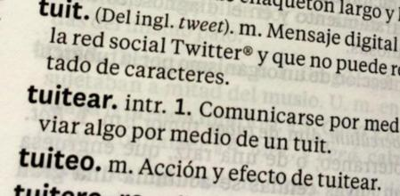

# HashMap

En esta unidad de Rust, aprenderemos cómo crear un **hashmap**, que es una colección de pares clave:valor.

### ¿Qué es un HashMap?
Un hashmap es una colección de pares clave:valor, muy parecido a un diccionario en la vida real. De la misma manera, un hashmap de Rust tiene una colección de claves y valores, donde la clave es la palabra y el valor es su significado.



::: tip 
De hecho, un hashmap en Rust es lo mismo que un *dictionary* en C# .
:::

### Cómo crear (instanciar) una nueva instancia de HashMap
Creamos una nueva instancia de hashmap con el método **new()** . Este procedimiento se conoce como creación de instancias porque creamos un nuevo objeto de instancia independiente a partir de la estructura hashmap.

```rust
//let mut map_name: HashMap<key_type, value_type> = HashMap::new();
let mut state_codes: HashMap<String, String> = HashMap::new();
```

### Cómo agregar clave:valores a una instancia de HashMap
Usamos el método **insert()** para agregar un par clave:valor a un mapa hash con notación de puntos. Las claves y los valores deben corresponder a los tipos definidos en la instanciación del hashmap.

```rust
let mut ciudades: HashMap<&str, &str> = HashMap::new();

//map_name.insert(key, value);
ciudades.insert("MAD", "Madrid");
ciudades.insert("BCN", "Barcelona");
```
### Cómo acceder a los valores de HashMap
Accedemos a los valores en un hashmap usando el método **get()** con la clave del valor al que queremos acceder.

```rust
let mut ciudades: HashMap<&str, &str> = HashMap::new();

ciudades.insert("MAD", "Madrid");
ciudades.insert("BCN", "Barcelona");

//map_name.get(key);
 println!("BCN: {:?}", ciudades.get("BCN"));
 //BCN: Barcelona
```

::: warning Tip
- Cuando intentamos acceder a un elemento que no existe con **get()** , devolverá **None** (la versión de Rust de nulo) en lugar de entrar en pánico.
:::

### Cómo verificar si existe un valor en un Hashmap
Comprobamos si existe un par clave:valor en un hashmap con el método **contains_key()** . Especificamos la clave del elemento que queremos verificar, el método devolverá **verdadero** si el par existe.

```rust
let mut ciudades: HashMap<&str, &str> = HashMap::new();

ciudades.insert("MAD", "Madrid");
ciudades.insert("BCN", "Barcelona");

//map_name.get(key);
 println!("BCN: {:?}", ciudades.get("BCN"));
 //BCN: Barcelona

if ciudades.contains_key("TO") {
    println!("TO: {:?}", ciudades.get("TO"));
} else {
    ciudades.insert("TO".to_string(), "Toledo".to_string());
}
```

El ejemplo anterior utilizará una declaración if para evaluar si existe la clave "TO". Si lo hace, se imprime; de ​​lo contrario, se agrega al hashmap.

### Cómo acceder a los valores de HashMap en un bucle
Si queremos recorrer los pares clave:valor de un hashmap, podemos usar el método **iter()** . El método iter() devolverá un iterador que contiene la referencia clave:valor de la iteración actual.

```rust
let mut ciudades: HashMap<&str, &str> = HashMap::new();

ciudades.insert("MAD", "Madrid");
ciudades.insert("BCN", "Barcelona");
ciudades.insert("TO", "Toledo");

/*for (key_variable, value_variable) in map_name.iter() {

    // hacer algo con key_variable
    // y/o value_variable

}*/
for (key, value) in ciudades.iter() {
        println!("{} - {}", key, value);
}
```
En el ejemplo anterior, recorremos todos los elementos en el hashmap, imprimiendo cada uno en la consola.

### Cómo eliminar un elemento de un Hashmap
Usamos el método **remove()** para eliminar un elemento del hashmap. Especificamos la clave del elemento que queremos eliminar como parámetro.

```rust
let mut ciudades: HashMap<&str, &str> = HashMap::new();

ciudades.insert("MAD", "Madrid");
ciudades.insert("BCN", "Barcelona");
ciudades.insert("TO", "Toledo");

for (key, value) in ciudades.iter() {
    println!("{} - {}", key, value);
}

//map_name.remove(key);
ciudades.remove("BCN");

println!("");
for (key, value) in ciudades.iter() {
    println!("{} - {}", key, value);
}
```
En el ejemplo anterior, eliminamos el elemento con la clave "BCN".

::: tip 
**Use un HashMap cuando:**

- Desea asociar claves arbitrarias con un valor arbitrario.

- Quieres un caché.

- Quiere un mapa, sin funcionalidad adicional.

**Utilice un BTreeMap cuando:**

- Le interesa saber cuál es el par clave-valor más pequeño o más grande.

- Desea encontrar la clave más grande o más pequeña que sea más pequeña o más grande que algo.

- Desea poder obtener todas las entradas en orden a pedido.

- Quieres un mapa ordenado por sus claves
:::


::: warning Resumen
- Un hashmap es una colección de pares **clave:valor**.
- Instanciamos una nueva instancia de hashmap con el método **new()**.
- Agregamos elementos como pares clave:valor con el método **insert()**.
- Accedemos a los elementos con el método **get()**.
- Accedemos a elementos en un bucle con el método **.iter()** y variables temporales (clave, valor).
- Probamos si existe un valor con el método **contains_key()**.
- Eliminamos un elemento de un hashmap con el método **remove()**.
:::
