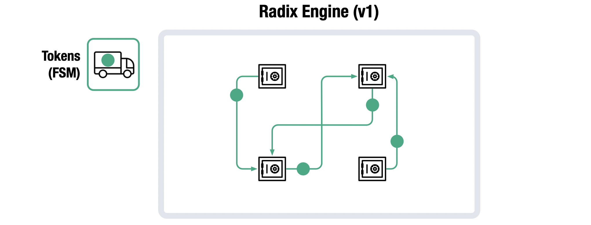

# Básico 2

::: tip Vídeo
- [Conceptos básicos 1 y 2](https://youtu.be/8GxgVdDLujk)
:::

## Los Activos
Volvemos a insistir en el concepto de **Activos** (en ingles **Assets**) ya que como habrás aprendido, en [Básicos 1](/scrypto/conceptos/conceptos1.md), Scrypto es un **lenguaje orientado a activos**. 

¿Qué es un *activo* en Radix? es un tipo de **recurso** que forma parte de la estructura de la plataforma. Cuando decimos que los activos en Radix son **físicos** queremos decir que son **reales** dentro de la plataforma, no simplemente un apunte dentro de un contrato inteligente como ocurre en la mayoria de proyectos blockchain.  

¿Donde viven, donde están exactamente estos activos en la red de Radix? ¿Donde sueles tener tu dinero... tus activos? En tu billetera, en un banco... De la misma manera los activos en Radix están resguardos en bóvedas 💰 dentro de tu cuenta o componente. 

¿Como logra esto Radix? El **Radix Engine** garantiza este comportamiento *físico* de los activos gracias a que utiliza un modelo bien restringido de *máquina de estados finitos* (FSM). Este modelo, *FSM*, está implementado en centrales nucleares o aviones de pasajeros, es decir en todo aquel lugar que requiera de comportamientos correctos y predecibles. Este modelo **FSM** es el que garantiza el transporte de los activos entre cuentas o bóvedas dentro de la plataforma Radix. 

 
::: tip 
El doble gasto no es posible gracias al modelo FSM
:::

::: warning Resumen
- Los activos en Radix son recursos reales
- FSM  garantiza el transporte de activos entre cuentas o bóvedas.
:::
