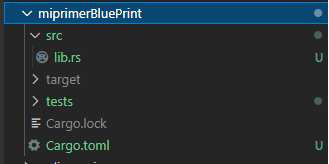

# Básico 4
### Autorizaciones con Badges (Insignias)

Es un nuevo concepto, en el mundo de los contratos inteligentes. Las Badges permite crear autorizaciones de acceso o acciones específicas. Este nuevo **patron de programación** permite crear credenciales o *Badges* que nos darán acceso, o no, a realizar ciertas acciones dentro de los contratos inteligentes. Una insignia no es un tipo primitivo: es una forma de referirse a un recurso que se utiliza principalmente para la autorización. Una insignia puede ser un recurso fungible o no fungible, según su caso de uso. Por ejemplo, necesita una credencial no fungible si desea asociar datos a una unidad de credencial individual. O una insignia fungible puede ser apropiada para definir un "rol" de autorización que se proporciona a muchos usuarios/componentes. Desde luego esto nos proporciona mucha más flexibilidad en la definición de reglas de seguridad.

::: tip
- A diferencia de Ethereum, donde el control de acceso se basa en la dirección de la persona que llama, en Scrypto la autorización se otorga en forma de insignias. Cualquier actor puede realizar una acción privilegiada si está presente la autorización adecuada para hacerlo.
:::

### Proof y Auth-Zone
Para usar de forma efectiva las insignias, Scrypto permite crear una Prueba o Proof de que poseemos una acreditación o insignia para realizar cierta acción. Gracias a este sistema no trasferimos nada, solo demostramos que tenemos autorización para realizar una acción.

Desde la versión 0.4 de Scrypto, se habilito una "Zona de Autorización" (**Auth-Zone**) que está en un nivel superior a las transacciones. Desde el [manifiesto de transacciones]() tenemos acceso a la zona donde se almacenan las Pruebas (Proofs) de que poseemos ciertas acreditaciones o insignias y así poder hacer uso de ellas, a esta zona se la conoce como Auth-Zone.

📗 Más información sobre Auth-Zone [aquí](https://docs.radixdlt.com/main/scrypto/scrypto-lang/access-control/access-introduction.html)

### Manifiesto de transacciones

Un manifiesto de transacción es la forma Radix de crear transacciones. Hace posible componer múltiples acciones para ser ejecutadas atómicamente describiendo una secuencia de llamadas de componentes y movimientos de recursos entre componentes. En resumen, la componibilidad atómica completa se hace posible directamente en las transacciones.

Los manifiestos de transacciones también pueden describir el uso de insignias para la autorización de componentes, el pago de tarifas de transacción y controles de cantidades de recursos para proporcionar resultados garantizados para el usuario.

📗 Más información sobre manifiestos de transacciones [aquí](https://docs.radixdlt.com/main/scrypto/transaction-manifest/intro.html).

### Package

Un *Package* es una colección de *Blueprints* que se compilan y publican como una sola unidad. Ya los hemos utilizado en las pasadas lecciones, cuando creamos nuestro primer blueprint:
```
scrypto new-package <nombre>
```
Si recuerdas al ejecutar este comando *new-package* Scrypto creo una carpeta con el *nombre* que escogimos, en aquel ejemplo el nombre fue 'miprimerblueprint':



Dentro de la carpeta *src* escribiremos los diferentes blueprints, si fueran necesarios. (*Nota: más adelante veremos como llamar a otros blueprint)   

Finalmente podemos concluir que un Package contiene uno o multiples blueprints que al publicarlo en la red de Radix esta le asigna una dirección que posteriormente podremos instanciar. 

::: danger Scrypto.exe
- Es el comando que nos permite crear Package (*Nota: entre otras cosas que ya veremos más adelante*)  

|Flags:||
|-------------|-----------------|
|-h, --help|Ayuda|
|-V, --version| Información de la version|

|Sub Comandos:||
|-------------|-----------------|
|build|Builds a package|
|fmt|Format a package|
|help|Prints this message or the help of the given subcommand(s)|
|new-package|Creates a package|
|test|Runs tests|
:::

Hasta aquí hemos repasado los conceptos más básicos de Scrypto, en las proximas lecciones analizaremos más detenidamente como usar la ayuda y documentación.

::: warning Resumen
- Badge permite crear credenciales para la ejecución o no de acciones.
- Package es una colección de blueprints.
:::
