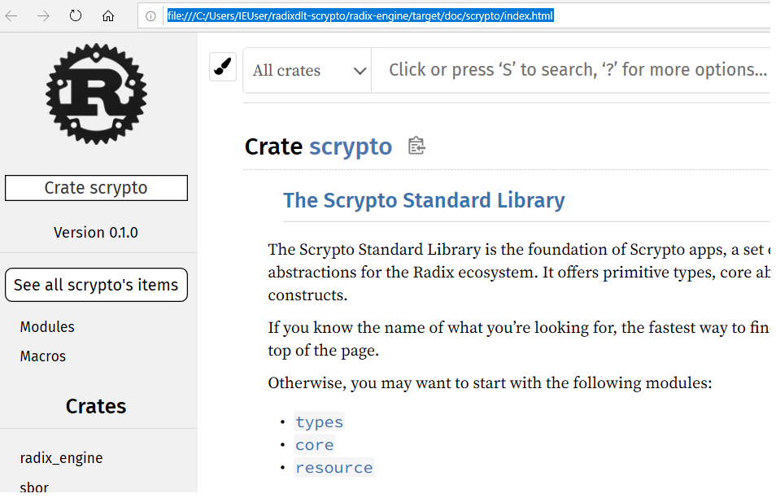
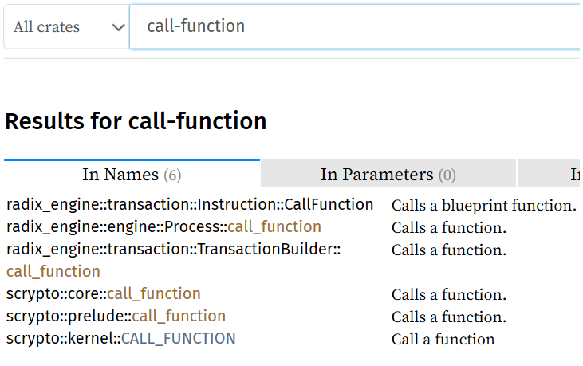
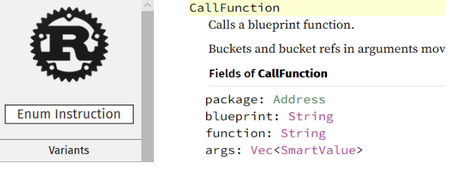

# 📜 Documentación

::: tip Vídeo
- [Soon ... Documentación]()
:::

Para instalar la documentación que trae Scrypto debemos ejecutar desde la carpeta *radixdlt-scrypto* el siguiente comando:

```
 C:\Users\<Tu_Usuario>\radixdlt-scrypto>./doc.sh
```
Este pasara a instalar la documentación. Si todo va bien nos abrirá el navegador y nos mostrará una ventana como esta:



En esta documentación en linea nos encontramos toda la biblioteca de Scrypto con sus tipos, abstracciones y recursos. Se ha implementado, en la parte superior, un potente buscador. 

Por ejemplo, imagina que quieres saber mas sobre el sub-comando *call-function*, pues solo tenemos que escribirlo en la caja del buscador:



Como ves, inmediatamente aparecen varios resultados que nos enlazaran con diferentes partes de la documentación. El primer resultado básicamente nos explica lo que ya hemos realizado en varias ocasiones ya, y es llamar a una función pasando la dirección del *package* , el nombre del blueprint, la función (normalmente *new*), y argumentos (como en el ejemplo anterior la temperatura: 20.5).



::: tip
Para poder volver a llamar a la documentación puedes hacer dos cosas: o guardar la dirección en tus marcadores del navegador, o volver a ejecutar el comando: *./doc.sh*.
:::

A partir de la siguiente unidad, en los casos prácticos haremos muchas referencias a la documentación para que os vayais acostumbrando a siempre acudir a ella ante cualquier duda o para poder usar nuevos recursos de Scrypto. Recuerda siempre que "La documentación es nuestra mejor alidada".

(*Nota: la documentación también la tienes en linea: [The Scrypto Standard Library](https://radixdlt.github.io/radixdlt-scrypto/scrypto/index.html)*)

### Bibliografia:
- [Scrypto - Getting Started](https://github.com/radixdlt/radixdlt-scrypto/blob/main/README.md)