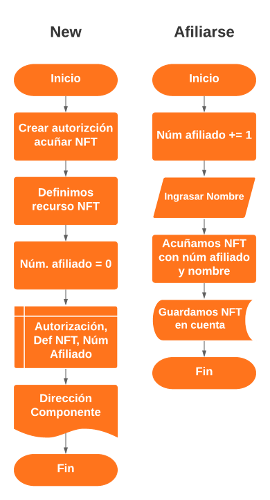

# Creación de DAO - Nuevos miembros

::: warning
- Esta unidad está actualizada para Scrypto version 0.4 o mayor -> [Instrucciones actualización](/scrypto/instalacion/actualizacion.md)
:::

::: tip 📺
- [Pronto Video Demostración]()
- [Código GitHub](https://github.com/AcademiaScrypto/Web-AccademiaScrypto-Espanol/blob/master/scrypto/codigo/unidad7.rs)
:::

Durante las siguientes unidades vamos a crear una DAO (Organización autónoma descentralizada), que sin duda durante 2022 están llamadas a ser tendencia y seguro que han llegad1o para quedarse entre nosotros. Aprender a crear DAOs puede tener un gran potencial. ¡Comencemos!

### Análisis
**Problema:** Deseamos crear una DAO donde los afiliado van a poder darse de alta sin ningún tipo de autorización. 

**Análisis:** Al pedirnos una DAO ya estamos dando por supuesto que vamos a crear una dApp. Para ello vamos a crear un *Componente*, dentro de la red de Radix, que nos va a permitir dar un *no fungible* a cada nuevo afiliado para que pueda demostrar su pertenencia y en un futuro identificarse dentro de la DAO.

### Diseño:


Dos diagramas: uno para la función constructora y el segundo para la primera funcionalidad que nos solicitan y es la de poder registrarse, cualquiera, al DAO retornando un *no fungible* como acreditación de su pertenencia al DAO. *(Nota: en cuanto más lenguaje más natural expresemos en estos diagramas mejor, yo a veces peco de incluir términos técnicos propios del lenguaje o plataforma que utilice)*

### Programación:

### NFT Estructura Datos:

Como ya vimos en la [unidad anterior](/scrypto/programacion/unidad5.md) *Scrypto* pone a disposición una macro para poder crear una estructura de datos, mutables e inmutables, que luego podremos incorporar a nuestros *no fungible*:

```rust
#[derive(NonFungibleData)]
pub struct DatosAfiliado {
    nombre: String
}
```

En este caso hemos llamado a la estructura: *DatosAfiliado* (recuerda, es algo arbitrario) y de momento solo le hemos implementado un dato de tipo *String* (Cadena de caracteres) para guardar el nombre del afiliado (será un dato inmutable).

### La estructura:

Vamos a necesitar crear un contador para guardar el número de afiliado, lo normal es que esta vez sea un número legible y no uno aleatorio, y que a su vez nos hará de identificador del NFT. Para poder utilizar como identificadores [*NonFungibleId*](https://radixdlt.github.io/radixdlt-scrypto/scrypto/engine/types/struct.NonFungibleId.html#) tenemos que crear un dato de tipo u32.

::: tip
|DATA TYPE   |MIN    |MAX |
| ---------- |-------|----|
|u8	         |0      |255 |
|u16         |0      |65535 |
|u32         |0      |4294967295 |
|u64	     |0      |18446744073709551615 |
|u128        |0      |340282366920938463463374607431768211455 |
:::

Luego necesitaremos guardar la dirección del recurso no fungible que queremos dar a cada afiliado, está será de tipo ResourceAddress.

::: tip
- Gracias a la dirección del recurso, ResourceAddress, podemos determinas si el no fungible que alguien nos presente es el que esperábamos o no. 
:::

Y de momento solo nos quedaría añadir un contenedor permanente (Vault) para guardar una *insignia* (badge) que autorice al Componente para mintear nuevos *no fungibles*. En este caso la insignia con autorización para acuñar se guardara en el propio componente para que la utilice cuando sea necesario. 

```rust
struct Sistema_afiliacion {
        badge: Vault,
        direccion_nft: ResourceAddress,
        num_afiliado: u32
}
```

### Función constructora *instantiate_dao*

1. Primero vamos a crear la autorización para crear el *no fungible*:
```rust
let badge = ResourceBuilder::new_fungible()
                .metadata("name", "Autorización mintear nuevos NFT")
                .divisibility(DIVISIBILITY_NONE)
                .initial_supply(1);
```
Creamos un recurso con, *ResourceBuilder*, de tipo fungible. El *name* que lo identifique, es especialmente interesante para poder identificarlo cuando realizamos *resim show*. Especificamos que no sera divisible. Y finalmente un suministro inicial de 1.

::: tip
Llamar .divisibility al crear un nuevo recurso es opcional. Si no se llama, la divisibilidad del recurso se establece en el valor predeterminado de 18.
:::

2. Creamos la definición *no fungible* que vamos a entregar a cada persona que se registre en el DAO:

```rust
let afiliado = ResourceBuilder::new_non_fungible()
    .metadata("name", "Afiliado DAO")
    .mintable(rule!(require(badge.resource_address())), LOCKED)
    .no_initial_supply();
```
En este caso el recurso será de tipo no fungible, *new_non_fungible*, y tiene varios métodos que pueden definir sus características:

-  *.metadata*: Permite dar nombre al recurso.

Seguidamente añadiremos al recurso una regla de autorización para poder acuñar nuevos *no fungibles*:  

```rust
.mintable(rule!(require(badge.resource_address())), LOCKED)
```
En este caso la regla solo permite a la insignia (badge) que hemos acuñado antes y que hemos guardado en el propio Componente. E incluimos el parámetro *LOCKED* que impide que sea modificado la regla de acuñación para este recurso. 

Finalmente, *.no_initial_supply()*, que indica que no vamos a crear inicialmente ningún suministro.

3. Pasamos a la estructura del componente:
    - La insignia (badge) que hemos creado para autorizar acuñar nuevos NFT, como tenemos el recurso (supply 1) en una variable, *badge*, podemos utilizar el comando *with_bucket* para crea una bóveda vacía permanente y llenarla con un depósito inicial de recursos contenidos en un bucket.
    - Pasamos la definición del recurso de NFT al componente.
    - Inicializamos la variable *num_afiliado* a cero. 

```rust
Self {
        badge: Vault::with_bucket(badge),
        direccion_nft: afiliado,
        num_afiliado: 0
    }
    .instantiate()
    .globalize()
```

### Método *afiliarse_dao*

Este método permite poder registrarse en la DAO como afiliado sin ningún tipo de autorización para ello, de forma totalmente libre. Solo ha de introducir un nombre de tipo string. 

El método al ejecutarse toma el nombre que se le ha indicado, añade 1 al num_afiliado para generar el nuevo número y finalmente acuña el NFT con esos dos datos: el numero afiliado como identificador y el nombre como dato inmutable. Finalmente el método devuelve un contenedor temporal con la acreditación de afiliado al DAO en forma de NFT a la cuenta que ha desencadenado este método. 


```rust
pub fn afiliarse_dao(&mut self, nombre: String) -> Bucket {
    self.num_afiliado += 1;

    self.badge.authorize(||{
        let resource_manager = borrow_resource_manager!(self.direccion_nft);
            resource_manager.mint_non_fungible(
                &NonFungibleId::from_u32(self.num_afiliado),
                DatosAfiliado {
                    nombre: nombre
                }
            )
    })
}
```

Pasamos la autorización para acuñar mediante el contenedor permanente *badge* de la siguiente manera:
```rust
self.badge.authorize(|| {
}
```
Tomamos el recurso ResourceManager a través del la siguiente macro *borrow_resource_manager!* a la que pasamos como parámetro la dirección del recurso que queremos utilizar *ResourceAddress* que hemos guardado en la variable *direccion_nft*.

```rust
let resource_manager = borrow_resource_manager!(self.direccion_nft);
```
::: tip
**ResourceManager** nos permite realizar operaciones como acuñar tokens adicionales, grabar tokens, actualizar metadatos, etc.
:::

Una vez tenemos el ResourceManager del recurso que queremos acuñar utilizamos el método *mint_non_fungible* al que pasamos los datos: identificador y los datos de la estructura que declaramos como *DatosAfiliado* que contiene el nombre del afiliado.

El tipo NonFungibleId nos permite dar al *no fungible* un identificador único. En este caso, el identificador será el número de afiliado que hemos generado y guardo en la variable *num_afiliado.

Como es un tipo u32 lo convertimos a *NonFungibleId* con el método *from_u32* que recibe como parámetro el número de afiliado.

```rust
&NonFungibleId::from_u32(self.num_afiliado)
```
Finalmente pasamos los datos del no fungible, en este caso solo el nombre que previamente pasamos como entrada al método. 

```rust
DatosAfiliado {
    nombre: nombre
}
```

### Código completo:

```rust
use scrypto::prelude::*;

#[derive(NonFungibleData)]
pub struct DatosAfiliado {
    nombre: String
}

blueprint! {
    struct Afiliacion {
        badge: Vault,
        direccion_nft: ResourceAddress,
        num_afiliado: u32
    }

    impl Afiliacion {

        pub fn instantiate_dao() -> ComponentAddress {
            
            let badge = ResourceBuilder::new_fungible()
                .metadata("name", "Autorización mintear nuevos NFT")
                .divisibility(DIVISIBILITY_NONE)
                .initial_supply(1);
                
            let afiliado = ResourceBuilder::new_non_fungible()
                .metadata("name", "Afiliado DAO")
                .mintable(rule!(require(badge.resource_address())), LOCKED)
                .no_initial_supply();

            Self {
                badge: Vault::with_bucket(badge),
                direccion_nft: afiliado,
                num_afiliado: 0
            }
            .instantiate()
            .globalize()
        }

        pub fn afiliarse_dao(&mut self, nombre: String) -> Bucket {
            self.num_afiliado += 1;
        
            self.badge.authorize(||{
                let resource_manager = borrow_resource_manager!(self.direccion_nft);
                    resource_manager.mint_non_fungible(
                        &NonFungibleId::from_u32(self.num_afiliado),
                        DatosAfiliado {
                            nombre: nombre
                        }
                    )
            })
        }
    }
}
```
### Compilación y ejecución

A estas alturas seguro que ya sabes publicar el *package*, instanciar el *Component* y llamar a los métodos pasando un parámetro.

::: warning Recuerda
- Antes de empezar siempre es recomendable limpiar el simulador con el comando:
```
resim reset
```
:::

::: details Solo para aquellos (tipo Emilio 🤪) que no quieren pensar!!!
1. Limpiar el simulador
```rust
resim reset
```
2. Crear un Package
```
scrypto new-package dao
```
3. Crear una cuenta (recuerda copiar la dirección de los XRD de tu cuenta)
```rust
resim new-account
set acct [Address de la cuenta que acabamos de crear]
```
4. Copiar o escribir el código (recuerda guardar ctrl + s)
- Recuerda guardar el código de este ejercicio dentro del archivo lib.rs que has creado en la carpeta *\radixdlt-scrypto\dao\src\lib.rs*
5. Publicar y guardamos la dirección del Package
```rust
resim publish .
set pack [New Package Reference]
```
6. Instanciar componente (recuerda que en este caso hay que añadir el argumento del precio) y guardar la dirección del componente.
```rust
resim call-function $pack Afiliacion instantiate_dao
set comp [dirección del componente]
```
7. Probar método *afiliarse_dao*
```rust
resim call-method $comp afiliarse_dao "Antonio Bitcoin"
// Ojo que cuando pasamos un dato de tipo string y tiene mas de una palabra debemos entrecomillarlo.
```
8. Comprobar el nft de afiliado
```rust
resim show $acct
```
:::

::: danger Importante:
- Soy muy consciente de que hay muchas que no has entendido, ¡TRANQUILO!, no te rindas, las entenderás... 😉
:::